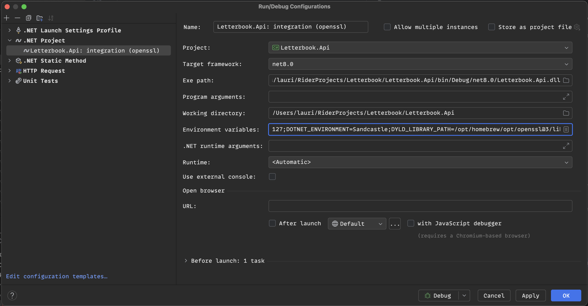
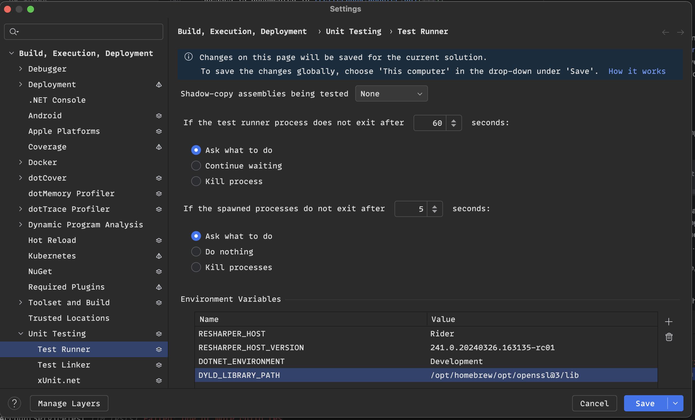

# Contributing to Letterbook

- [Code of Conduct](#code-of-conduct)
  - [Responsible "AI" Contributions](#responsible-ai-contributions)
- [Collaboration](#collaboration)
  - [Getting started](#getting-started)
  - [More than code](#more-than-code)
- [Documentation](#documentation)
  - [Useful links](#useful-links)
- [Development](#development)
  - [Quick Start](#quick-start)
  - [Navigating the Codebase](#navigating-the-codebase)
    - [Start with `Letterbook.Core`](#start-with-letterbookcore)
    - [Work on the UI](#work-on-the-ui)
    - [Work on the first-party or third-party (mastodon) API](#work-on-the-first-party-or-third-party-mastodon-api)
    - [Work on ActivityPub handling](#work-on-activitypub-handling)
    - [Work on message queue workers](#work-on-message-queue-workers)
    - [Work on other features](#work-on-other-features)
  - [Running the Server](#running-the-server)
  - [Running tests](#running-tests)
  - [Using VS Code](#using-vs-code)
  - [Using Jetbrains Rider and VisualStudio](#using-jetbrains-rider-and-visualstudio)
  - [Dependencies](#dependencies)
    - [~~Docker~~](#docker)
    - [Postgresql](#postgresql)
    - [Host secrets](#host-secrets)
    - [MacOS OpenSSL](#macos-openssl)
  - [Debugging Federation](#debugging-federation)
- [License](#license)


## Code of Conduct

Please read the [Code of Conduct][coc]. It's adapted from the commonly used contributor covenant, but it's not just boilerplate. Be sure you can uphold the project's shared values and abide by the standards laid out in that document. You're more than welcome to ask for clarification.

These values will have a direct impact on the features we do and don't implement, how we prioritize them, and how they are designed. For example:

* We believe tracking and mass data harvesting are dangerous and unethical; we won't build or support those activities and will attempt to limit the personal data we collect
* We believe that cryptocoins, NFTs, and related technologies are purposefully wasteful and deceptive; we will not incorporate them
* We believe so-called AI—especially generative AI—is extractive, wasteful, hazardous, and usually deceptive; we will view it with skepticism
* We will prefer opt-in rather than opt-out dynamics wherever possible
* We will seek and respect consent, by helping people to make well informed choices without manipulation
* We will build moderation and administration tools that preserve autonomy and privacy, as well as foster safety

### Responsible "AI" Contributions

We hope that you'll view contributing to the project as joining a team. As a team, we want to learn and grow together, and to support and respect each other. Notably, we feel that submitting large or critical changes that are generated by so-called AI tools is disrespectful of the other contributors and is counter to our values. We expect that the author of a change should be able to explain their reasoning, and help to educate others, not merely produce code. You're welcome to use any tools you find helpful, but not at the expense of other people's time and attention. Probabilistic code generators (such as Copilot), shift burden and effort from the author to the reviewer, and it quickly becomes a net negative for the project.

## Collaboration

Before you jump in and start working, the first thing to do is to talk to us. We will likely need to talk through the project goals, or the system design and architecture. And even if not, there's a good chance that whatever seems most urgent to you also seems most urgent to someone else. We would rather coordinate our efforts, to minimize waste and frustration when multiple people do overlapping work.

### Getting started

The best thing to do is to look through our active project board. Currently, that's [Single User Preview][preview-board]. Go through our open issues, and the to do items in the epics. If something catches your eye, the best thing to do is to comment on it, and tag the maintainers so we see it. That helps us open up a dialog, and we can talk though our vision and make sure you're set up to work on the issue, if you choose. You're also welcome to open new issues if you don't find something you expected.

### More than code

We are more than happy to have any contribution you can make. But, the things we most need are **user experience research and design**. And a close second is **web UI** design and/or implementation. We would love to talk to anyone with **trust and safety** experience, or general fediverse **admins**. We're building this for you, and we really want the tools we build to be useful for you. You can help make that happen, just by answer questions or giving advice. **Technical communicators, community managers, project managers, and marketing or developer relations** experience would also be such a boon to the project. Are you just hyped and want to stay up to date with what's happening in Letterbook? Let us know; we can chat. And if you're a **_librarian_** or have any kind of experience in that vein, please, **please reach out**.

## Documentation

Writing docs is both hard and valuable. Because a lot of things about the project are still being established, it's even harder than normal. This means there's not a lot of documentation yet. This will be a focus in the near future. What we do have is several [Architecture Decision Record][adr-what] docs. You should look throught them. This is likely the best way to get up to speed on the [design, goals, and constraints][adr] for the project.

### Useful links

We plan to support enough of the Mastodon API to provide good compatibility with Mastodon clients. So you may find these docs to be valuable. They also provide some useful information about how to interoperate with other federated services.

* [Mastodon Docs](https://docs.joinmastodon.org/)
* [Mastodon API routes](https://docs.joinmastodon.org/dev/routes/)
* [ActivityPub Spec](https://www.w3.org/TR/activitypub/)
* [ActivityStreams Vocabulary](https://www.w3.org/TR/activitystreams-vocabulary/)

## Development

We've tried to make the process to get up and running as easy as possible. But it's easy for the people who work on a project regularly to not notice when complexity drifts in. If it's not straightforward to at least build and run the app for development, let us know and we'll try to correct that.

Most things are not implemented, but some of it has been stubbed out to provide some structure to the project. Letterbook is still in the very early stages. So if something looks broken, it probably is; it's not just you.

### Quick Start

This will get you up an running quickly. You can skip ahead for some discussion of our dependencies if you like.

0. [Install the dotnet 8 SDK][dotnet] and a docker runtime with docker compose (either [docker desktop][docker] or [podman][podman] should work)

1. Start up the database
```shell
docker-compose up -d
```

2. Migrate the database
```shell
dotnet tool retore
dotnet ef database update --project Letterbook.Adapter.Db/Letterbook.Adapter.Db.csproj
dotnet ef database update --project Letterbook.Adapter.TimescaleFeeds/Letterbook.Adapter.TimescaleFeeds.csproj
```

3. Add an application host secret
```shell
dotnet user-secrets set "HostSecret" "$(openssl rand -base64 32)" --project Letterbook
```

4. Run Letterbook (in watch mode)
```shell
dotnet restore Letterbook.sln
dotnet watch run --project Letterbook.Web
```

5. Open the UI http://localhost:5127  
There is also a Swagger UI http://localhost:5127/swagger/index.html

### Navigating the Codebase

#### Start with `Letterbook.Core`

Letterbook is organized in a modular fashion, which allows the service to be run in multiple different configurations. This allows the project to have a relatively simple initial setup, and also to scale up and down gracefully to (hopefully) support any expected load. However, this could make the project a little bit hard to navigate, at first. Most of the specialized application logic is contained in the Core services and data models. It's likely those will be involved when adding features or fixing bugs. Depending on what you're trying to do, you may also need to make changes in one of these projects:

#### Work on the UI

- `Letterbook.Web`

All the web UI views and controllers are located there.

#### Work on the first-party or third-party (mastodon) API

- `Letterbook.Api`

All the API controllers and DTOs are located there. Note the DTO (data transfer object) type mappers, as they play a large role in the function of the API.

#### Work on ActivityPub handling

- `Letterbook.Adapter.ActivityPub`
- `Letterbook.Api`

Most of the functionality related to ActivityPub is in one of those projects. The Api hosts the ActivityPub endpoints, notably the inbox. It also serves `activity/json` documents when they're requested by ID. The ActivityPub adapter provides a client to send and fetch AP documents. The client signs outgoing requests on behalf of the appropriate Actor, when possible. The adapter also configures extensions to the basic ActivityStreams types, and mappers to/from core domain models.

#### Work on message queue workers

- `Letterbook.Workers`

All the workers are defined and configured in the Workers project.

#### Work on other features

Other adapters may of course be involved. If a change requires a new or updated db query, that would happen in the Adapters.Db project. That's also where db migrations are configured. The TimescaleFeeds project plays a critical role with timelines and notifications. Other adapters are critical when working with their respective features.


### Running the Server

Letterbook is meant to be easy to set up and run. The default `Letterbook` host project provides all the functionality of the service. However, it's also possible to run the major components on their own. In development, you can run the `Letterbook` project from any of the launch settings. 

### Running tests

Unit tests are included in the main solution. They should run in a few seconds and have zero dependencies.
```shell
dotnet test Letterbook.sln
```

Integration tests are located in a separate solution, because they depend on a real database, and take longer to run. First, start your Postgres instance, then you can run the tests.
```shell
dotnet test Letterbook.IntegrationTests.sln
```

### Using VS Code

There are recommended extensions and `launch.json` targets configured in the repo. Install the extensions and then run the `Letterbook` configuration.

Tests can be run from the suggested test explorer extension.

### Using Jetbrains Rider and VisualStudio

There are `launchSettings.json` targets configured in the repo. Open Letterbook.sln and then run the `Letterbook: http` configuration.

Tests can be run from the built-in test runner.

### Dependencies

#### ~~Docker~~
Docker is _not_ actually a dependency for Letterbook. We use docker as a convenient way to manage our other dependencies in development, but you can use other methods if you prefer. To do that, you should read on to the following sections. We don't plan to ever introduce a real dependency on Docker, although we will likely (eventually) publish a docker container image for admins who prefer that option.

#### Postgresql
Letterbook depends on a Postgres database. It attempts to seed an initial administrator account on startup, so you must have the database available in order to run the app. Letterbook depends on the database for essentially everything, so even if we didn't require it on start up, we would require it for any API call you could make.

If it's your first time setting up the database you will need to apply the Database migrations by running the entity framework tools.

This processes is documented in more detail at [Letterbook.Adapter.Db](Letterbook.Adapter.Db/readme.md).

#### Host secrets
Letterbook depends on a host secret which comes from a secret provider in order to mint and validate authentication tokens. In development, you can use Dotnet user secrets. (We don't have a production solution, yet 😅). In the interest of developing good security practice, this is not something we can provide in the repository. You have to generate your own secret.

> [!NOTE]
> We should really do this with the database password/connection string, too

```shell
dotnet user-secrets set "HostSecret" "$(openssl rand -base64 32)" --project Letterbook
```

The actual value isn't important as long as you're just running and debugging locally. So if you don't have openssl you can use any string of 32 characters. But using cryptographically secure secrets is a good habit to build.

#### MacOS OpenSSL

At the moment, Letterbook uses `System.Security.Cryptography` for its RSA implementation. On Linux and MacOS, this is backed by the system's OpenSSL library. If you are running on MacOS, you are likely to run into an exception:

```
System.PlatformNotSupportedException: OpenSSL is required for algorithm 'RSAOpenSsl' but could not be found
```

You can fix this by installing OpenSSL via [Homebrew](https://brew.sh) and providing its library path to the dotnet 
runtime. This is done by setting the environment variable `DYLD_LIBRARY_PATH`. The correct value might vary by version,
but it's likely to be `/opt/homebrew/opt/openssl@3/lib`.

If your run dotnet from the command line, you can add the environment variable to your shell's startup script.

If you use JetBrains Rider as your IDE, things are a bit more complicated. Rider doesn't launch via a shell, and MacOS
doesn't currently seem to provide a way to set global environment variables. You can work around this by either adding the
environment variable in the [launch settings file](Letterbook.Api/Properties/launchSettings.json) or creating a
local launch configuration in Rider and configuring the environment variable there:



For test runs, you can set the path in Rider settings: 
Settings -> Build, Execution, Deployment -> Unit Testing -> Test Runner




### Debugging Federation

In addition to Letterbook's own dependencies, you may find it useful to have a 3rd party system to exercise federation. The [Letterbook Sandcastles project][sandcastles] provides pre-configured instances of some other fediverse software. We encourage you to make use of that, and to contribute configurations for any other federated peers you're familiar with.

There is a `Letterbook.Api: sandcastle` launch setting that is preconfigured to work well with the Sandcastle project. The configured host name will be `https://host.docker.castle` when using that option. Peer services running in Sandcastles should be able to connect to Letterbook using that domain.

## License

Letterbook is licensed under the [AGPL, version 3.0][license]. The maintainers may, at our discretion, update to any future version of that license. Anyone who contributes to the project must do so under the same terms. That is, you are licensing your work to the project and the other contributors under that same license and any future version as becomes necessary.

[dotnet]: https://dotnet.microsoft.com/en-us/download
[docker]: https://www.docker.com/products/docker-desktop/
[podman]: https://podman.io/
[swagger]: http://localhost:5127/swagger/index.html
[coc]: https://github.com/Letterbook/Letterbook/blob/main/CODE_OF_CONDUCT.md
[preview-board]: https://github.com/orgs/Letterbook/projects/5/views/4
[minimum-board]: https://github.com/orgs/Letterbook/projects/1/views/2
[license]: https://github.com/Letterbook/Letterbook/blob/main/LICENSE
[adr-what]: https://www.redhat.com/architect/architecture-decision-records
[adr]: https://github.com/Letterbook/Letterbook/tree/main/docs/decisions
[sandcastles]: https://github.com/Letterbook/Sandcastles
