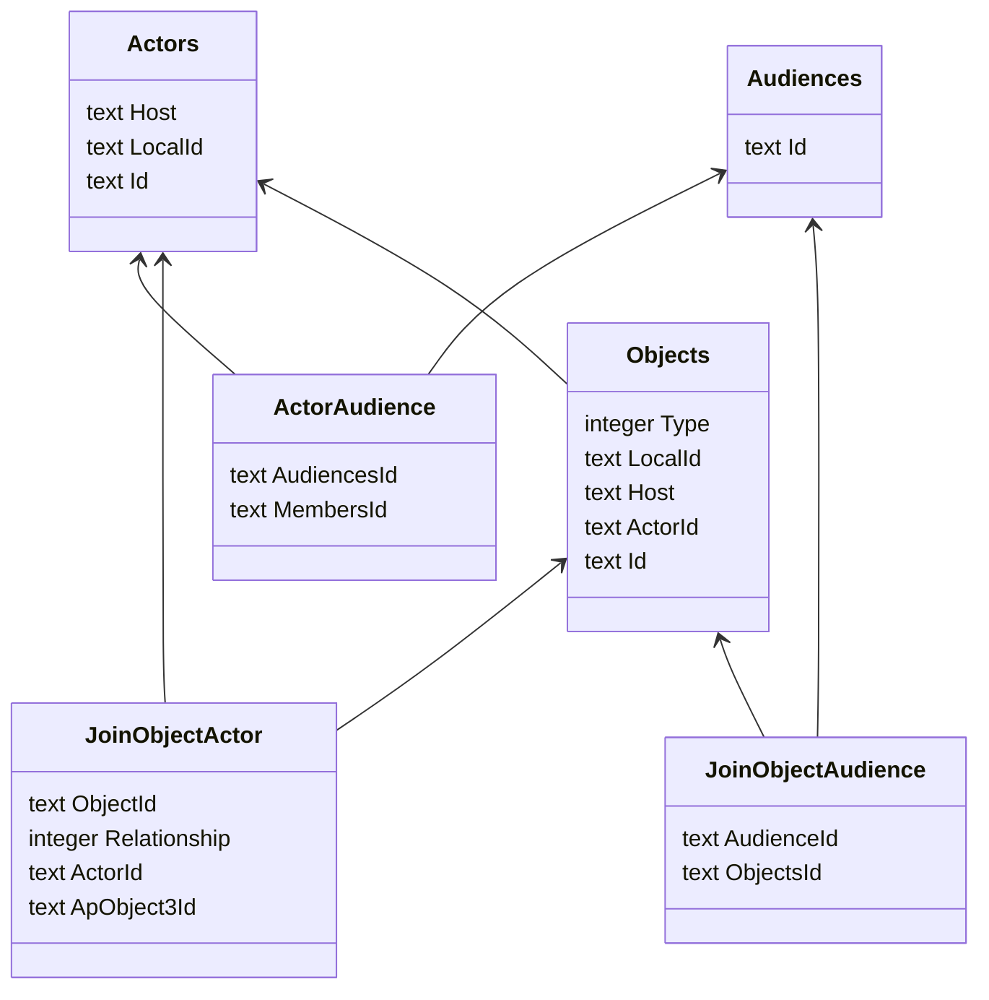

```mermaid
classDiagram
direction BT
class ActorAudience {
   text AudiencesId
   text MembersId
}
class Actors {
   text Host
   text LocalId
   text Id
}
class Audiences {
   text Id
}
class JoinObjectActor {
   text ObjectId
   integer Relationship
   text ActorId
   text ApObject3Id
}
class JoinObjectAudience {
   text AudienceId
   text ObjectsId
}
class Objects {
   integer Type
   text LocalId
   text Host
   text ActorId
   text Id
}

ActorAudience  -->  Actors
ActorAudience  -->  Audiences
JoinObjectActor  -->  Actors
JoinObjectActor  -->  Objects
JoinObjectAudience  -->  Audiences
JoinObjectAudience  -->  Objects
Objects  -->  Actors

```