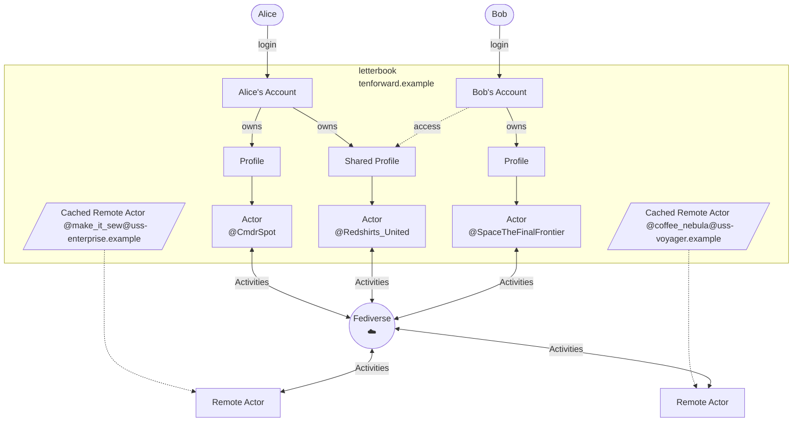

# Accounts vs Profiles vs Actors

Clarifying the difference between these concepts, and the value of having them be different.

# Decision

An account, profile, and actor are all closely related to a1 user. In this context, a user is a person. As in, a human being2 who is using the application to send, receive, and interact with notes and other users. Generally all the things that are implied when a person says that they're "on ~~mastodon~~ the fediverse." The thing about computers is that they suck at infering things, so all the implied stuff has to be explicit. All of these things make up a computational model of people trying to do things in the real world. Getting the boundaries right on the pieces of that model will make it possible to support those people and the things they do over time, even as more people want to do increasingly complicated things. In other words, this is an exercise in domain modelling.

## Models

* **Account**. An account is the thing that a person logs into. It has the closest relationship with that person, as they exist in the outside world. That's where we manage things like passwords, emails, and preferences.
* **Profile**. A profile is the thing that is presented to the rest of the social network. This is where we manage things like handles, display names, profile pictures, follows, and followers.
* **Actor**. An actor is how profiles are represented and transferred in the ActivityPub fediverse. This is how Letterbook will present a profile to other services, and this is how we will understand and interact with users of those other services. It presents essentially all the same information as the profile does, but in a serialized format specified by the federation protocol.

I've tried to capture these relationships here:

* 1 potentially more than one user, in the case of profiles that represent an organization. But that's the end, and we're at the beginning.
* 2 or bot. This stuff gets complicated rapidly.

## Impact

The immediate result is that these models and db entities need to be created and used. On the one hand, it's probably a bit more work than simply using a singular monolithic "user" model, or similar. On the other hand, this should continue to provide good flexibility for a long time. And, it can ease development and testing, by isolating work on message handling and federation from concerns about authentication.

In the longer term, this also creates the possibility that accounts can be connected to more than one profile, and that profiles can be connected to more than one account. This can enable things like easier and more robust management of bot profiles, shared access to profiles representing organizations, or delegating moderation powers between trusted contacts.

## Context

This permits us to separate how people log in from how they would send and receive messages. That's nice for individuals, because it gives them more flexibility to divide up their online persona, if they want to. For instance, having personal and professional profiles. The other thing this enables is to allow a single profile to be controlled by multiple accounts. And I think that is critical to organizations. And that really applies to all organizations.

As one example, imagine a union drive. The organizing committee may need to exert some public pressure, and they may use social media accounts to do so. With shared control, the organizers can all easily see the mentions and interactions that the public union profile has. And they can maintain separation, or even anonynimity, from their personal profiles. By the same token, businesses need this kind of capability to empower marketing or customer support teams to respond to public communication. One of the better aspects of twitter (and other networks, but twitter in particular) is the possibility of shaming large companies into treating people like people. That's not likely to ever happen in the fediverse if those companies never have a presence there. And considering things in a more collaborative light, people do commerce with each other, and they'll use communication tools which support that. I worry that purely donation supported social media may never be sustainable. I think supporting the needs of businesses—and enabling them to pay for those features—offers a path to financial viability that doesn't rely on advertising and the bad incentives that creates.

## Discussion

This ADR largely ignores permissions and access controls surrounding shared profiles. That's an important and complex topic, and one that warrants careful consideration. In addition to this account/profile domain modelling, that will also depend on how we implement an authorization model.

[See the PR](https://github.com/Letterbook/Letterbook/pull/37/files)
