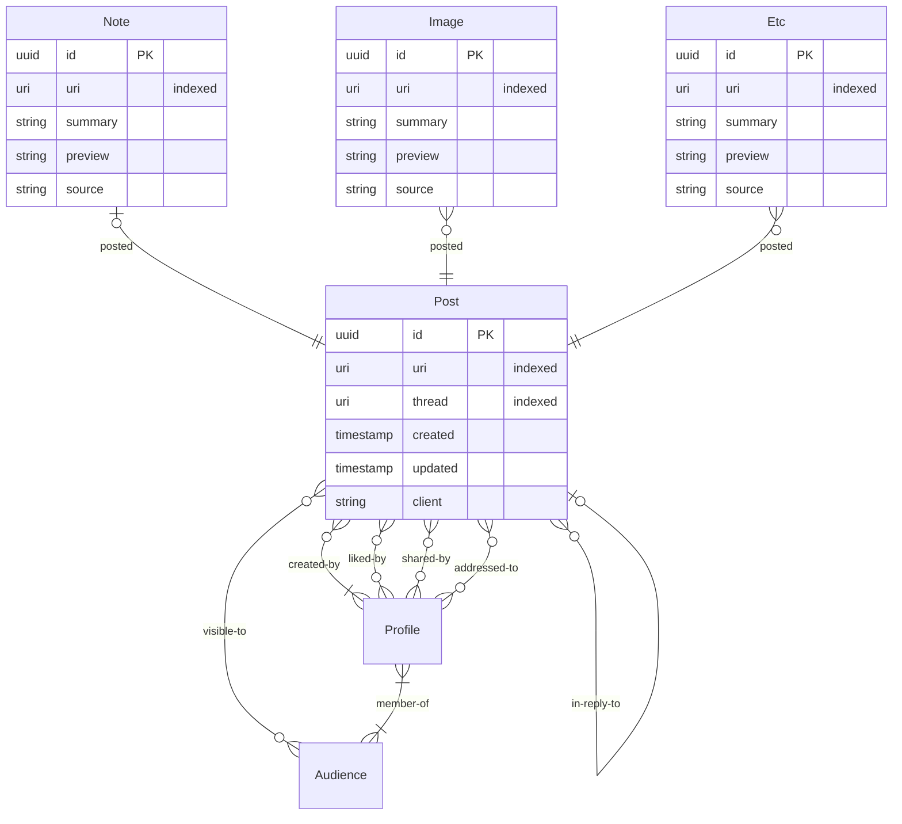
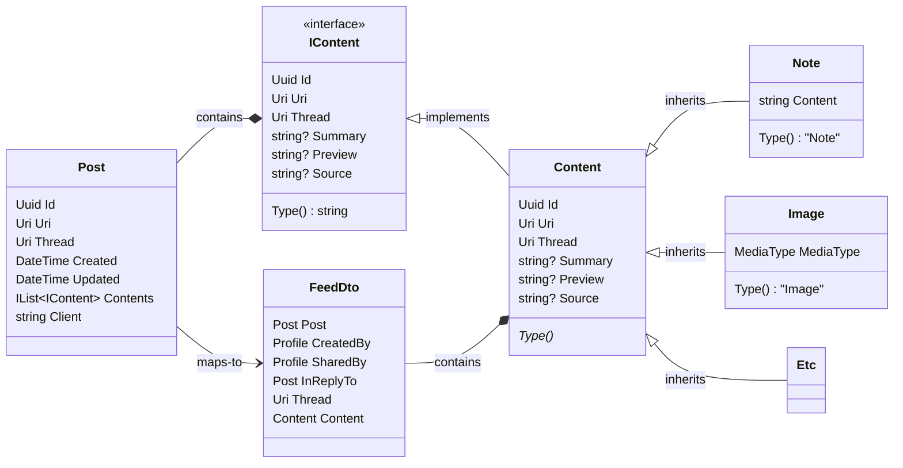

---
title: Data Model for Generic Posts
code: adr-7
order: 7
statusHistory:
- status: decided
  date: 2024-01-02
---

# Data Model for Generic Posts

We can expect almost any of the ActivityStreams Object types to federate in a way that resembles a post. And we will want to do the same eventually; we don't need to limit ourselves to just Notes. This offers a way to represent posts in a timeline, thread, etc independently of their specific content.

# Decision

The basic idea is to decouple the posts that make up a feed or thread from their content. We define a `Post` type, which is a container for specialty content that would populate the post. We would start with `Notes` and `Images` as content, but other types like `Polls`, `Events`, `Articles`, and so on would be supported in the future. Each content record can belong to at most 1 Post. Here's a simplified model of what those relations look like. `Profile` and `Audience` already exist and would be essentially unchanged.

So, everything becomes a post, with some child content items. It doesn't currently happen (much?) in the wild, but this would allow us to easily handle activities that include multiple content-like objects (multiple notes, images, questions, mix-and-match, etc). The types above are mostly illustrative, not complete or final. The idea is that they would implement an interface, call it `IContent`, which would provide enough information to build a feed of posts. That would make it a lot easier to actually provide those feeds to clients. Without *something* like that, clients would have had to make at least one follow-up request to get the actual content of feed items that were otherwise only a list of IDs/URLs.

## Impact

This will obviously introduce some new data types. It's also likely to require some complex migrations. It should ideally happen soon, before any serious work starts on posting-related features.

You may also notice that this data model is more restrictive than what ActivityPub would allow. Notably, Posts can only be InReplyTo at most one other Post (and no other kind of object). A Note can only be in one Post and vice-versa. And because `IContent.Thread` would map to `AS Context`, a post can only have one context and exist in one thread. These restrictions should be fully compatible with the actual behavior of other fedi services in the wild. It helps to narrow the possibility space that we would actually have to deal with, and should support faster queries for the most common cases (when a post is a note and nothing else). This means that there could be potential future fedi peers that we would not be readily compatible with.

## Context

The content-related data schema we have now is troublesome to work with, and that will only get worse over time. It was developed quickly, very early in the project, and it was always likely that it wouldn't be viable in the long term. The original schema was useful to provide some anchor points to develop an internal data model that isn't simply replicating all of ActivityPub (a likely impossible task). It also provided a point to iterate from. Now we're iterating, with more care and more context.

For reference, the model we have now is that various classes (`Note` and `Image` at the moment) implement an `IContentRef` interface, and that's kind of it. Those objects can be assigned a resolvable URI based on their types, and those URIs are the critical component of Feed records. To actually use this system in practice, the client would retrieve a batch of records for the feed, and it would consist of little more than URI which it would have to then issue individual follow-up requests to resolve. Which is not great. It's also surprisingly difficult to map AP docs to these objects. I'm not sure this design solves that problem on its own, but I think it does become easier to build a `ContentFactory` or similar, which was likely always going to be necessary. Then we can map them to `Content` objects, as built by the factory, which can handle the logic of deciding what concrete type to construct.

## Discussion

### notes or just post body?
Is it better to have notes as a content object of the post, or should the note just be sort of body properties on the post? It's probably more complicated to serialize reliably if the post body becomes a note on the wire. But it would save a join for the large majority of records. Sort of. The join is still necessary for the query, because we still need the other content items. But there would be no results from the other joined tables most of the time, and I expect the query planner to handle that efficiently.

### schema
Making each content record include-able in only one post saves on potentially a _ton_ of many-many joins. This makes it more involved to re-use uploaded media. For example, to reuse the same reaction gif repeatedly. We would need to introduce other models to track those uploads as files, not just post content. But, that seems worth it to me.

We can defer that model design until we start work on the [file/media features](https://github.com/Letterbook/Letterbook/issues/139).

### hypothetical compatibility
Not attempting to be universally future compatible seems reasonable. It's not like it would be possible anyway. We can work to improve compatibility in the future, if such an incompatible peer service should ever be created.

### need the interface?
Do we need `IContent`, or is the base/abstract `Content` class enough?

### AS inReplyTo
AP/AS have some types that are pretty obviously content: `Note`, `Image`, `Document`, `Video`, `Audio`, `Article`, `Page`, `Event`, `Question`. It's not hard to figure out what it means for something to be `inReplyTo` one of those types. But, `Object` is the base type for everything in ActivityStreams, and the spec permits any object to be `inReplyTo` any other object. What does it mean if a `Note` is in reply to a `Collection`, or a `Profile`, or an `Update`? I don't know, and neither do the spec authors. So, we're just not dealing with that. If we ever start receiving federated documents doing that, then we can decide how to handle it. And honestly that might mean we just choose to discard those activities for being incomprehensible to our data model. It seems like that would have to be either a very different app than ours, or just a nonsensical implementation.

### Quotes?
How does this design model quote posts?

There are a couple of options. We can experiment when we get to that point, but the one that seems most likely is if `Post` also implements `IContent`, and then other posts can simply be part of the contents collection. [See the PR for some discussion](https://github.com/Letterbook/Letterbook/pull/144).
