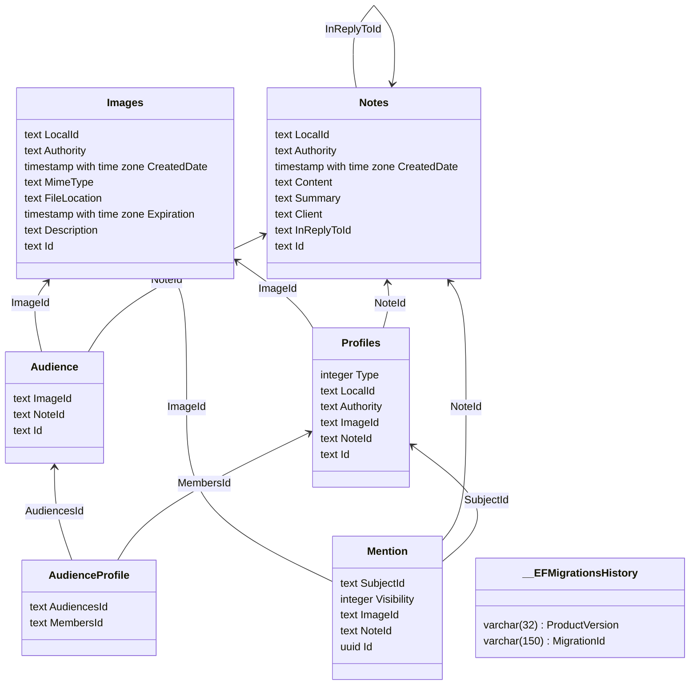

```mermaid
classDiagram
direction BT
class Audience {
   text ImageId
   text NoteId
   text Id
}
class AudienceProfile {
   text AudiencesId
   text MembersId
}
class Images {
   text LocalId
   text Authority
   timestamp with time zone CreatedDate
   text MimeType
   text FileLocation
   timestamp with time zone Expiration
   text Description
   text Id
}
class Mention {
   text SubjectId
   integer Visibility
   text ImageId
   text NoteId
   uuid Id
}
class Notes {
   text LocalId
   text Authority
   timestamp with time zone CreatedDate
   text Content
   text Summary
   text Client
   text InReplyToId
   text Id
}
class Profiles {
   integer Type
   text LocalId
   text Authority
   text ImageId
   text NoteId
   text Id
}
class __EFMigrationsHistory {
   varchar(32) ProductVersion
   varchar(150) MigrationId
}

Audience  -->  Images : ImageId 
Audience  -->  Notes : NoteId
AudienceProfile  -->  Audience : AudiencesId 
AudienceProfile  -->  Profiles : MembersId 
Mention  -->  Images : ImageId 
Mention  -->  Notes : NoteId
Mention  -->  Profiles : SubjectId 
Notes  -->  Notes : InReplyToId 
Profiles  -->  Images : ImageId 
Profiles  -->  Notes : NoteId
```