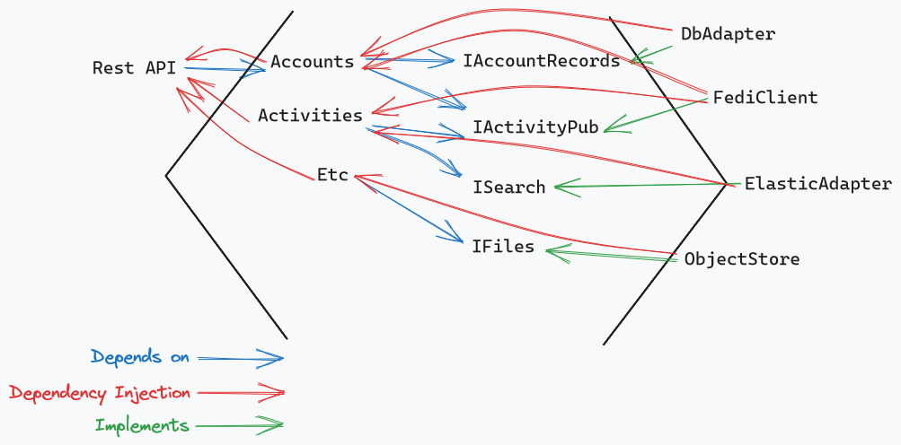

# Architecture and Design Patterns

Using a hexagonal architecture for the overall application. And using query objects as the general pattern to manage db access.

## Status

- [x] Decided (2023-07-04)
- [ ] Decided Against
- [ ] Deferred
- [x] Superseded ([2024-02-16][adr-08])

# Decision

## Hexagonal Architecture

The application should generally follow a hexagonal architecture. There are a number of good discussions online of what a hexagonal architecture is and how to implement it. I think [this one from Hackernoon](https://hackernoon.com/hexagonal-architecture-introduction-part-i-e51h36id) is pretty good. So is [this one by Pablo Martinez](https://medium.com/ssense-tech/hexagonal-architecture-there-are-always-two-sides-to-every-story-bc0780ed7d9c). It is essentially a layered architecture. The outer layer provides adapters that handle interaction with clients, APIs, databases, and so on. The inner core handles the main application logic. What distinguishes this from other layered architectures is that direct dependencies should only point inward, toward the core application and domain logic. Core components can depend on each other, but cannot have any dependencies on adapters. Adapter components can only depend on core components, and not on each other.

This is facilitated through dependency injection. Left side adapters are generally thought of as action drivers. User action or other real world events are received by those adapters. They invoke core modules, which process and act on that input. Those core modules define interfaces for the capabilities they need, such as to query and record application data. Right side adapters implement those interfaces, and are registered in the DI system. The core modules depend on the interfaces they've defined, and dependency injection provides the implementations.

This box-and-arrow diagram gives an idea what this would look like for a partial set of Letterbook modules. These haven't been implemented yet and will likely change but I hope this conveys the idea.

There are several major benefits to this pattern. I think the biggest may be that it enforces loose coupling. Despite the best intentions, it can often happen that UI, domain, and database code all get tightly linked through transitive dependencies. In this design, those kind of transitive dependencies are very difficult to even create, let alone abuse. Another major benefit is that the core application logic can relatively easily define whatever structure and models make sense for the domain, independently of the APIs and etc that will make use of that core application.

All of that has very desirable effects

* Core logic and adapters are mostly very easy to test
* Code continues to be easy to evolve
* Changes are mostly very isolated
* Adding new interfaces has minimal impact on existing functionality

## Query Objects

The query object pattern is about data access, so this pertains to the database adapter module(s). The adapter still needs to fulfill the interface defined by core modules, and that interface should focus on the needs of those core application classes. Query objects account for an internal implementation detail of that adapter. I'm including it here because database access is a critial component of any application that has a database, and there's no architectural pattern which can change that.

In the query objects pattern, database queries and encapsulated by an object. That is, a specific object represents and performs a specific query. This includes managing transaction lifetimes. Query objects also provide good points to perform optimizations. Most query objects can be built around ordinary ORM methods. When needed, others can break out of the ORM and use hand crafted SQL. Query objects also provide good opportunities to do query batching and prepared statements.

## Impact

This is more guidance, really. But these two patterns should guide essentially all of the foundational work we're doing at this point.

## Context

There are probably many patterns that would make sense and give good results. But I think HexArch is particularly well suited to Letterbook's use case. The separation of concerns and loose coupling will create natural points to break up work in distributed systems in order to support very high capacity configurations. Yet still supporting single-binary distributions for small scale deployments. 

Beyond that, I think it's important to have *some* pattern. Having an established pattern gives structure to everything. It makes things more consistent, and guides the way development will happen.

## Discussion

Hexagons are the bestagons.

[adr-08]: ./08-architecture-update-01.md