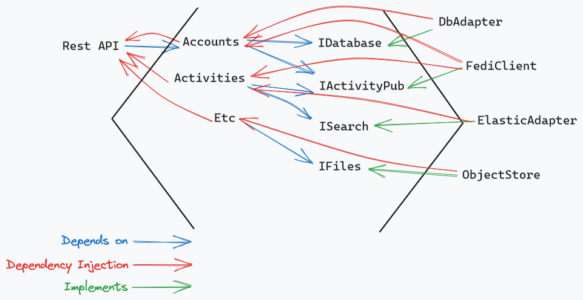

# Architecture and Design Patterns

Using a hexagonal architecture for the overall application. And using query objects as the general pattern to manage db access.

## Status

- [ ] Decided (proposal was agreed and adopted)
- [ ] Decided Against (agreed not to adopt)
- [ ] Deferred (no decision, but should be revisited later)
- [ ] Superseded (later events or decisions make this no longer relevant)

# Decision

## Hexagonal Architecture

The application should generally follow a hexagonal architecture.

## Query Objects

## Impact

Details about what changes because of the decision

## Context

Information about the situation that prompted the proposal/decision

## Discussion

A summary of the comments/issues/concerns that led up to the decision