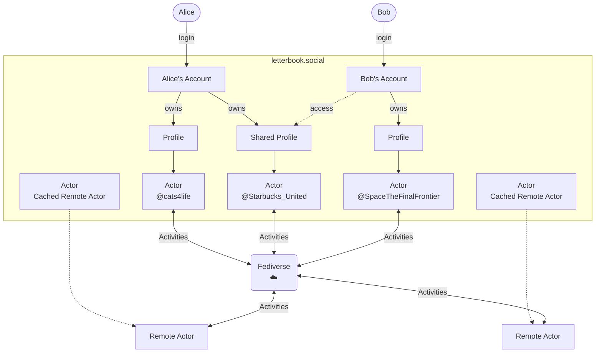

# Accounts vs Profiles vs Actors

Clarifying the difference between these concepts, and the value of having them be different.

## Status

- [ ] Decided
- [ ] Decided Against
- [ ] Deferred
- [ ] Superseded

# Decision

## Impact

Details about what changes because of the decision

## Context

This permits us to separate how people log in from how they would send and receive messages. That's nice for individuals, because it gives them more flexibility to divide up their online persona, if they want to. For instance, having personal and professional profiles. The other thing this enables is to allow a single profile to be controlled by multiple accounts. And I think that is critical to organizations. And that really applies to all organizations.

As one example, imagine a union drive. The organizing committee may need to exert some public pressure, and they may use social media accounts to do so. With shared control, the organizers can all easily see the mentions and interactions that the public union profile has. And they can maintain separation, or even anonynimity, from their personal profiles. By the same token, businesses need this kind of capability to empower marketing or customer support teams to respond to public communication. One of the better aspects of twitter (and other networks, but twitter in particular) is the possibility of shaming large companies into treating people like people. That's not likely to ever happen in the fediverse if those companies never have a presence there. And considering things in a more collaborative light, people do commerce with each other, and they'll use communication tools which support that. I worry that purely donation supported social media may never be sustainable. I think supporting the needs of businesses—and enabling them to pay for those features—offers a path to financial viability that doesn't rely on advertising and the bad incentives that creates.

## Discussion

A summary of the comments/issues/concerns that led up to the decision
