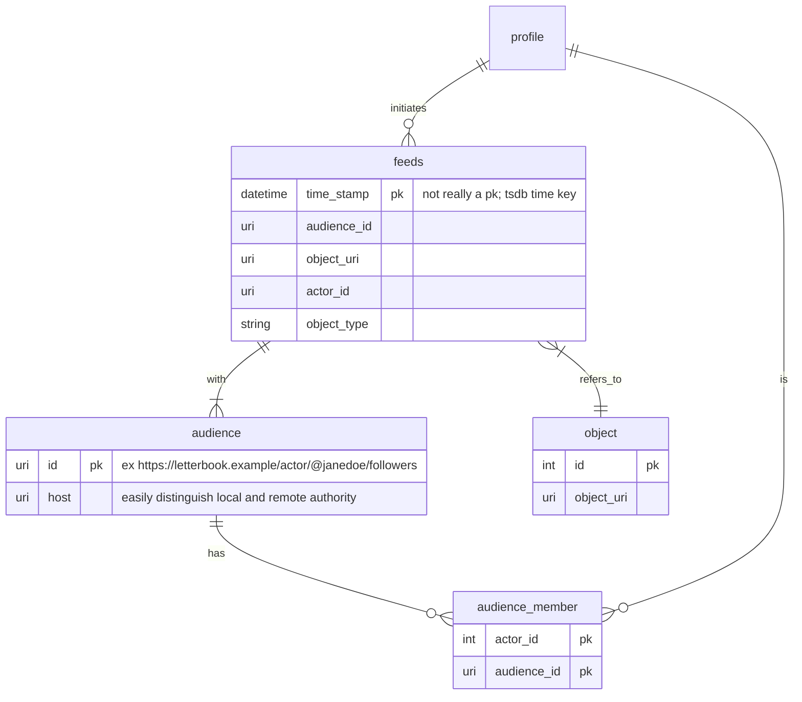

# Building Timelines

This document attempts to design and describe, at a high level, the data models and schemas involved in sharing posts and using them to build timelines. This is (I hope obviously) a work in progress.



## Background

Timelines are the central interaction mechanism for a microblogging service. They need to service extremely high queries rates for relatively large data volumes, as well as constant writes. The returned results need to respect the followings, filters, and lists that are specified for the profile, as well as the creator's and instance's blocks/mutes/etc. As far as I can tell Mastodon (and Calkey/Firefish) accomplishes this by just dumping regular posts into redis and then issuing fairly complex queries to filter down to the correct set of posts to fill out a user's timeline. We're not doing that. Redis is expensive, and scaling it is even more expensive. Also, maybe it's just me, but I think just loading everything into RAM is actually not great system design? And even with the performance of entirely in-memory storage, querying Redis isn't free. Thanks to the hex pattern, changing course and using Redis in the future remains an option, of course.

Instead, we'll be using a timeseries database. Specifically, TimescaleDB, at least to start. Timeseries DBs are analytic—as opposed to transactional—databases. The basic premise is that by giving up on relational integrity, the database can very quickly select, filter, and aggregate very large sets of records. And timeseries DBs in particular, are designed around doing this with data that is ordered and queried chronologically. Exactly like a timeline.

## Details

But, again, there's no relational integrity with any of this. So looking up a post's creator's followers to determine whether it should be excluded by this WHERE is a non-starter. This means we need to do some pre-processing of our data to make it easy to query without those relations. The solution to that is the `Audience` concept. Before they're added to the tsdb, posts get lightly pre-processed to generate audience keys, and these keys essentially constitute feeds, which can be easily merged at query time. Typical audiences would be `public`, the creator's `followers`, and the `mentions` for anyone mentioned in the post. Then to populate a feed, the timeline service will query the feeds table with something like this:

```sql
SELECT time_stamp, post_id, audience, boosted_by
FROM feeds
WHERE audience in ('set', 'of', 'audience', 'keys', 'for', 'the', 'feed')
    AND time_stamp >= $start_time
FETCH $limit
OFFSET $start
GROUP BY (post_id)
ORDER BY time_stamp desc
```

The query engine is able to do this very very fast, because there are no foreign or unique keys or the related constraints on this table. And everything is already ordered by the timestamp.

The common case is the home feed, where the set of audiences is the profile's mentions, follows, and follows' boosts. But this same process applies to other scenarios. Lists as well as filters for boosts and media are well established alternatives, but this mechanism would actually allow us to create feeds for anything where we can identify a useful audience key. In ActivityPub terms, just about any collection could have an audience. ActivityPub also specifies that ability for actors to define arbitrary collections for themselves. This would permit people to curate lists or categories of their own content, and Letterbook users would be able to follow those categories. Assuming the sending server informs us about the category, that is.

If you noticed that this means we'll be duplicating a lot of data in this table, you get a gold star. This is again not a significant concern thanks to the properties of timeseries databases. There are two factors behind this. One, is that TSDBs can achieve extremely good at-rest compression by using column-oriented storage. Two, these databases are very good at ejecting old data. In fact, if you're fine with letting the db do whatever is easy (and I am), this happens basically for free. Everything is already time-ordered and stored as columns on disk. Those columns are already further partitioned by time, as a query optimization. Because of this, partitions that are older than your chosen expiration time can just be discarded with practically no effort.