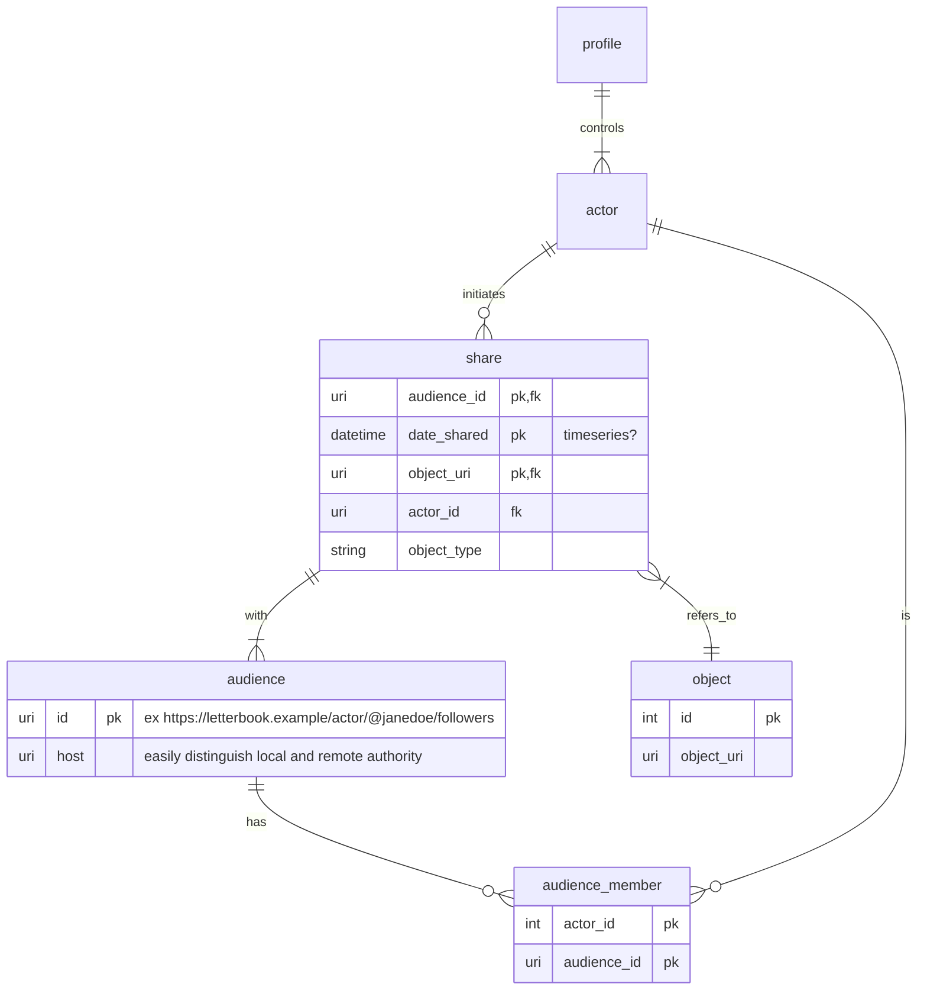

# Building Timelines

This document attempts to design and describe, at a high level, the data models and schemas involved in sharing posts and using them to build timelines. This is (I hope obviously) a work in progress.

