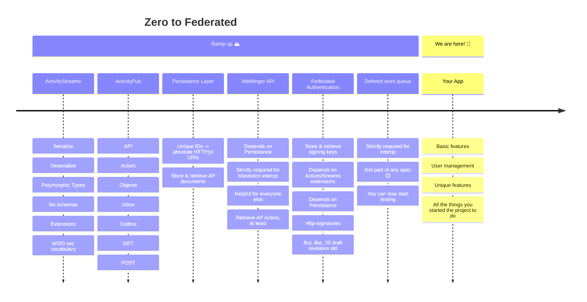

# Letterbook

Letterbook is a federated microblogging service, implementing ActivityPub. The project was started with the hope to make hosting a fediverse server a better and more sustainable experience. We also want to make it a safer and more inclusive space for the people who make the fediverse their social media home. Those are big aspirations, but we have some solid plans about how to start, and [we would love more input about where to go from there](#contributing).

## Features
I hope it goes without saying, but we will support most of the features you use regularly on other fedi apps. Things like hashtags, custom emojis, lists, filters, editable posts, account migration, and so on.

### [For Admins and Ops](https://github.com/Letterbook/Letterbook/issues/131)
#### Easy setup for new instances
Letterbook initially deploys as a single executable with simple load-balanced scaling. 1 server and 1 database is all you need to get up and running, aside from ancillary services like object storage and email. And if you do see huge scale in your future, you can still scale outward to distributed task workers and microservices.

#### Lower cost and complexity
Letterbook doesn't maintain any live state. Everything lives in the database, so there's no need to run a Redis cluster or similar to act as shared state storage. We also expect to have significantly lower compute demands, due to both the architectural choices to avoid expensive infrastructure and system sprawl, and the use of C#, a very high performance compiled language.

#### First class observability
Letterbook is thoroughly instrumented for both automatic and custom telemetry, including robust logging, metrics, and distributed tracing. We also provide out-of-the-box collection and dashboards for our telemetry. You can investigate errors, bugs, and performance issues the same way we the developers would.

### [For Moderators](https://github.com/Letterbook/Letterbook/issues/132)
#### Local-only posts
Avoid context collapse! You can talk to your users and they can talk to each other, without risking context collapse by exposure to the whole fediverse.

#### Automatically expiring actions
Moderator actions like blocking, muting, and limiting federation will all be able to automatically expire after a set time.

#### Fine grained federation controls
You'll be able to do things like prevent federated posts from appearing in promoted feeds, prevent them from appearing at all without an established follow relationship, hide posts behind a click-through and warning, and defederate without breaking your users follow relationships, in addition to the same basic options as other servers.

#### Other moderator tools
- Keep and share notes
- Audit logs
- Auditable privileged views of non-public posts
- Spam and quality filters
- And more

### For Members
#### Frequently requested features
- Quote replies
- Collapse notifications
- Block, limit, and remove replies to your posts
- Propose and accept edits to alt text and content warnings
- Compose multi-post threads
- Save drafts and scheduled posts
- Formatted posts (bold, italics, lists, and block quotes, at least)
- Emoji reactions

#### Mastodon apps
We intend to implement the Mastodon API, which will provide support for many existing Mastodon apps. Over time, we expect our features will grow well beyond what Mastodon supports, of course. But until we do, or if those features don't interest you, your current favorite app will still be there for you.

#### Better discoverability
Letterbook will have features like topic detection and topic based feeds. Follow recommendations will also consider topics you express an interest in and friends-of-friends relationships.

#### More sophisticated authoring and following options
We hope to support long form, multi-page posts. We'll also be able to create multiple promoted feeds for your own posts, and have the ability to follow those feeds specifically. If for some strange reason people want to follow your analysis of CVEs and not your fursuit friday posts, that's a doable thing. And you'll eventually be able to co-author posts with other people.

#### Real DMs
We plan to provide a real direct message experience by implementing an XMPP server. If you used to use jabber, it's likely that your old favorite chat client is ready and waiting for you, better than ever. And if you never stopped, then you probably know that better than we do, and hopefully this is good news for you. You will of course be able to send and receive posts with restricted visibility, just like you do now, so you won't lose access to Mastodon-style direct messages with your contacts.

## Background

All of this is just the beginning of what we have planned for Letterbook. We're very excited about the future, and we get to build it together. If you'd like to read more about the thought process that went into starting the project, [you can do that here](https://jenniferplusplus.com/letterbook/).

## Contributing

This project is still in the very early stages, but we would love to have more contributors. This is a project built *for* the community, and it should also be built *by* the community. Unfortunately, things probably aren't established enough yet that someone could jump in without guidance. But, we would be happy to provide that guidance! Please reach out here on github, or on the fediverse.

1. The best way to get a sense of what's planned and in-progress is to look through [our main project board, Single User Preview](https://github.com/orgs/Letterbook/projects/5/views/2)
2. After that, please have a look at the [Contributing Guide](./CONTRIBUTING.md)

## History

It might help to put all this in context of what has and hasn't been done already. [Jenniferplusplus](https://hachyderm.io/@jenniferplusplus/111342566946755633) shared a timeline graphic very similar to this on mastodon, and you might have seen it there. So, it seems to be fitting to try to situate this project in that timeline. At this point, we've essentially climbed the first mountain, and now we're surveying all of the other mountains we still have ahead of us. Right now is a great time to join the project. There's so much that needs to be done, and also a solid foundation to work from.

## Maintainers

* [@jenniferplusplus@hachyderm.io](https://hachyderm.io/@jenniferplusplus)
* [@runewake2@hachyderm.io](https://hachyderm.io/@runewake2)
