# Letterbook

Letterbook is intended to be a mastodon-compatible federated microblogging server. The project has three primary goals:

1. Functional compatibility with Mastodon, and Mastodon clients
2. Reduced cost and complexity to deploy and operate
3. More robust moderation tools

## Background

I hate the term microblogging, but I love the dynamic of it. Or at least the dynamic it can facilitate. I prefer to call it open correspondence. In fact, that open correspondence is the origin of the name. In the times when written letters were the standard technology for communicating across distances, a letter book was an actual book used to store and file those letters. Letterbook is where you keep your correspondence. Out of all the options which support that kind of open correspondence, I believe the fediverse has the most upside, and by far the most future potential. But I have concerns about the sustainability of the fediverse as it stands now, and I'm hardly the only one. Topics like cost, admin burnout, and haphazard moderation come up frequently. Letterbook is an attempt to address those concerns.

I also sometimes macroblog. If you'd like to read more about the thought process that went into starting the project, [you can do that here](https://jenniferplusplus.com/letterbook/).

## Contributing

This project is still in the very early stages, but we would love to have more contributors. This is a project built *for* the community, and it should also be built *by* the community. Unfortunately, things probably aren't established enough yet that someone could jump in without guidance. But, we would be happy to provide that guidance! Please reach out here on github, or on the fediverse.

1. The best way to get a sense of what's planned and in-progress is to look through [our main project board, Single User Preview](https://github.com/orgs/Letterbook/projects/5/views/2)
2. After that, please have a look at the [Contributing Guide](./CONTRIBUTING.md)

## History

It also might help to put that in context of what's already been done. [Jenniferplusplus](https://hachyderm.io/@jenniferplusplus/111342566946755633) shared this timeline graphic on mastodon, and you might have seen it there. So, it seems to be fitting to try to situate this project in that timeline. At this point, we've essentially climbed the first mountain, and now we're surveying all of the other mountains we still have ahead of us. Right now is a great time to join the project. There's so much that needs to be done, and also a solid foundation to work from.

```mermaid
%%{init: { 'theme': 'default' } }%%
timeline
    title Zero to Federated
    section Ramp up 🏔️
    ActivityStreams Types       : Serialize : Deserialize : Polymorphic Types : No schemas
    ActivityPub API             : Actors : Objects : Inbox : Outbox
    ActivityPub GET             : Depends on ActivityStreams Types
    Persistance Layer           : Unique IDs -> absolute HTTP(s) URIs : Store & retrieve AP documents
    Webfinger API               : Depends on Persistance : Strictly required for Mastodon interop : Helpful for everyone else : Retrieve AP Actors, at least
    ActivityStreams, Advanced   : Extensions : W3ID sec vocabulary
    Federated Authentication    : Store & retrieve signing keys : Depends on ActivityStreams, Advanced : Depends on Persistance : Http-signatures : But, like, 20 draft revisions old
    ActivityPub POST            : Depends on everything else : You can finally start testing
    section You are here! 🎉
    Your App                    : Basic features : User management : Your unique features : All the things you started the project to do
```

## Maintainers

* [@jenniferplusplus@hachyderm.io](https://hachyderm.io/@jenniferplusplus)
